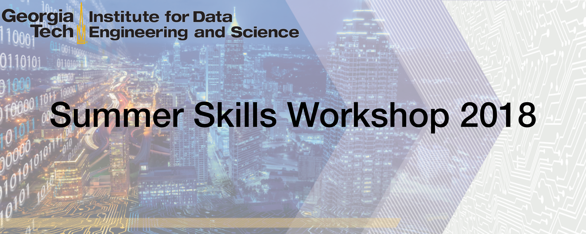

  

---

### Overview

Welcome to the Insitute for Data Engineering and Science (IDEaS) Summer Workshop
in Data Science and Scientific Computing!

This workshop will attempt to engage graduate students and postdocs in the
comptational sciences, natural sciences, and engineering disciplines to provide
an introduction to scientific computing and programming with emphasis on the
following topics:

* Scientific Computing using the Python programming language
* Numerical Linear Algebra
* Databases
* Machine Learning

This workshop will consist of a one-hour lecture each week by a faculty member
covering one of the above topics (two lectures for Python, one lecture for each
remaining topic), where a weekly project meant to acquaint participants with
the topic will be assigned.  This lecture will then be followed by a hands-on
session in which the project and any necessary skills will be discussed, and
any questions addressed.  This repository is meant to accompany these hands-on
sessions and projects, as well as introducing workshop participants with the
principles of and best practices for social coding.

### Getting Started

In order to begin using this repository for this workshop, please make sure
that you have a GitHub account and local Git installation on your personal
computer, either for the command line (default for Mac OSX and Linux) or using
the [GitHub Desktop client](https://desktop.github.com/) (available for Mac OSX
and Windows). Next, [fork this
repository](https://guides.github.com/activities/forking/#fork) by clicking the
"Fork" button in the top right-hand corner of this page, and [clone your
fork](https://guides.github.com/activities/forking/#clone) to your local
machine.  All contributions to this repository, including submission of weekly
out-of-class projects, should be within a [pull
request](https://guides.github.com/activities/forking/#making-a-pull-request)
opened from your fork to this repository upstream.  When opening your pull
request, please include in the PR description a brief "journal entry" for the
week describing some challenges you faced when completing the assignment and
how you overcame them, or any thoughts you had while working on the problems.
This is also your opportunity to provide some brief feedback regarding the
assignment and/or the hands-on activity, and how effective it was at
introducing and allowing you to practice the week's topic. Then, the TAs and
workshop organizers can provide feedback within pull request reviews each week.

Weekly materials are contained within directories in the top-level of this
repository named `Week0X` for the `X`th week of the workshop, with specific
discussion and/or instructions provided in the directory's `README.md` file.
Please ensure that your files for the weekly assignment are organized and named
according to those instructions, as they are intended to avoid accidental merge
conflicts between participants' assignment submissions based on similarly named
files.

Good luck and happy coding!!

~ The IDEaS Summer Workshop Team

